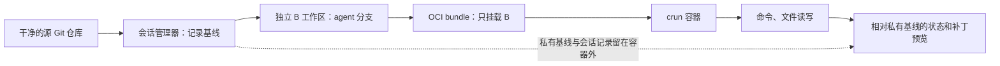

# bbm-sandbox：C++ / crun 隔离会话原型

这是一个面向 Linux 的 C++17 沙箱原型和 SDK。它从干净的 Git 仓库创建独立任务工作区，在 OCI 容器中运行命令，并提供工作区文件读写和改动预览。容器运行时使用 crun。

当前实现适合本机开发、集成和学习容器隔离流程；它还不是可直接暴露给不可信用户的生产服务。

## 已实现功能

- **会话管理：**创建、查询、执行、预览改动和停止会话。默认以普通用户和 rootless crun 运行。
- **独立 Git 工作区：**每个会话得到自己的 `agent` 分支和 Git 元数据。Agent 可以在容器中使用 Git 并提交；源仓库不挂入容器，也不会被任务修改。
- **隔离的基线与预览：**管理器在容器外保留私有基线。状态和二进制补丁都相对该基线生成，因此 Agent 在工作区内提交后，改动仍可预览。
- **两种容器环境：**默认的 HostTools 模式以只读挂载复用本机工具链；Minimal 模式使用静态 BusyBox、Git 和文件助手构建较小的环境。
- **受监督的命令执行：**参数数组直接传给进程，不经 shell 拼接；分别捕获 stdout/stderr，并处理超时、输出上限及二进制 stdin。
- **受限的文件 API：**SDK 和 CLI 可在工作区内读写二进制文件；路径边界、符号链接、特殊文件和文件大小均受检查，写入采用同目录临时文件和原子替换。
- **C++ SDK：**构建树和安装包均提供 `sandbox_core`；安装包导出 CMake target `bbm::sandbox_core`。

## 工作流程



源仓库必须是已提交且干净的 Git 工作树，暂不支持 submodule。B 工作区从选定提交创建，包含该提交可达的历史；其他分支、未提交内容、未跟踪文件和忽略文件不会复制进去。会话目录必须新建在源仓库之外，且其父目录已存在。

独立 `workspace` 命令也可单独创建和检查 B 工作区，不启动容器。

## 环境与隔离

### HostTools（默认）

HostTools 为每个会话生成轻量 rootfs，并只读、非递归地挂载本机存在的系统工具目录：`/usr/bin`、`/usr/lib`、`/usr/lib64`、`/usr/libexec`、`/usr/include`、`/usr/share`、`/bin`、`/lib` 和 `/lib64`。具体挂载取决于本机目录布局；`/usr/bin` 和 `/usr/lib` 必须存在。

工作区默认挂载到 `/workspace`，也可用 `--workspace` 更改（快速开始示例将其设为 `/project`）。会话另有独立可写目录 `/build`、`/env` 和 `/cache`；它们不进入 Git 改动预览，停止会话后仍保留在会话目录中。默认环境变量包括：

- `PATH=/env/python/bin:/usr/bin:/bin`
- `HOME=/env/home`，`TMPDIR=/build/tmp`
- `XDG_CACHE_HOME=/cache`，`PIP_CACHE_DIR=/cache/pip`
- `PIP_REQUIRE_VIRTUALENV=true`

CMake、GCC/G++、Ninja、Python 等工具需要预先安装在导入的系统目录下。Python venv 可放在 `/env/python`。宿主机 home、`/run`、完整的 `/etc` 和 `/usr/local` 不会导入；HostTools 导入目录中的文件对任务可见，因此这些系统目录不应存放需要隐藏的数据。该模式会随本机工具升级，不提供版本锁定。

### Minimal

Minimal 仅准备 BusyBox、Git、SDK 文件助手及 Git 运行所需动态库。它要求 `/usr/bin/busybox` 为静态链接版本，并依赖宿主机的 `/usr/bin/file` 和 `/usr/bin/ldd`，适用于需要较小工具集的场景。

### 默认隔离与资源限制

rootless 模式下，容器内 UID/GID 0 各自映射到当前宿主机用户的一个 UID/GID；容器内的 root 不等于宿主机 root。任务没有 Linux capabilities，启用 noNewPrivileges，rootfs 只读。工作区可写，HostTools 的 build、env、cache 可写；`/tmp` 和 `/dev/shm` 是各自 16 MiB 的临时文件系统。网络命名空间隔离，默认没有外网连接。

默认限制为：

| 项目 | 默认值 |
|---|---:|
| 内存 | 256 MiB |
| Swap | 0 |
| CPU | 1 核配额（period 100000 µs，quota 100000 µs） |
| 进程数 | 64 |
| 单条命令超时 | 2000 ms |
| 命令输出上限 | 8 MiB |
| 单文件读写上限 | 8 MiB |

SDK 的 `Options` 可调整这些限制；CLI 当前只开放命令超时和 CPU 配额参数。内存和进程数控制器必须由 cgroup v2/systemd 用户会话委派。默认 CPU 配额还要求委派 CPU controller；本机尚未委派时，可用 `--cpu-quota-us 0` 显式关闭 CPU 配额进行调试。创建时会核对实际 cgroup 限制，未成功应用请求的限制时会拒绝创建会话。

需要启用这些委派时，可由管理员为 systemd 用户服务添加配置，然后重新加载 systemd 并重新登录：

```ini
# /etc/systemd/system/user@.service.d/delegate.conf
[Service]
Delegate=cpu memory pids
```

```bash
sudo systemctl daemon-reload
# 退出并重新登录，使用户服务重新加载委派设置
```

文件助手依赖 Linux 5.6+ 的 `openat2`。内核不支持时，文件读写会失败，不会降级到较弱的路径检查方式。

## 构建

依赖 Linux、CMake、C++17 编译器、Git、crun 和 `nlohmann_json`。rootless 会话要求内核启用用户命名空间和 cgroup v2；默认运行时路径是 `/usr/local/bin/crun`。若项目旁边有 `../vcpkg`，CMake 会自动使用其中的 vcpkg toolchain；也可以通过 `CMAKE_TOOLCHAIN_FILE` 显式指定。

```bash
cmake -S . -B build
cmake --build build -j4

# 运行测试套件；rootless 容器测试需要本机具备相应内核和 cgroup 配置
ctest --test-dir build --output-on-failure
```

构建生成 `sandboxctl`、`sandbox-io` 和静态库 `libsandbox_core.a`。默认配置用于开发树资源路径，不可直接安装。构建可安装 SDK 的版本时，需关闭开发构建并指定安装前缀：

```bash
cmake -S . -B build-sdk \
  -DSANDBOX_DEVELOPMENT_BUILD=OFF \
  -DCMAKE_INSTALL_PREFIX="$PWD/install" \
  -DBUILD_TESTING=OFF
cmake --build build-sdk -j4
cmake --install build-sdk
```

安装包包含 CLI、文件助手、SDK 库和头文件，并导出 CMake package。调用方可用 `find_package(bbm-sandbox CONFIG REQUIRED)`，并链接 `bbm::sandbox_core`。

## 快速开始

以下命令请以普通登录用户运行。输入仓库应有至少一个提交，且工作区干净。创建命令会输出 JSON，其中 `id` 字段是会话 ID。

```bash
./build/sandboxctl session create /absolute/path/to/clean-repo \
  --workspace /project --cwd . --timeout-ms 10000 --cpu-quota-us 0

# 将下面的示例值替换为创建结果中的 id
ID=replace-with-session-id

# 在工作区写文件并读取
./build/sandboxctl session exec "$ID" -- /bin/sh -c 'echo hello > /project/hello.txt'
./build/sandboxctl session exec "$ID" -- /bin/cat /project/hello.txt

# 查看相对初始提交的改动预览
./build/sandboxctl session changes "$ID"

# 停止容器；会话文件和工作区会保留
./build/sandboxctl session stop "$ID"
```

示例使用 `--cpu-quota-us 0`，是为了兼容未委派 CPU controller 的开发机；这表示不设置 CPU 配额。CPU 已委派时可省略该参数，默认按一核限制。创建时选定的命令超时会应用于每条命令。HostTools 是默认环境；可通过 `--environment minimal` 切换。

文件 API 使用容器内的绝对路径，只允许访问配置的工作区：

```bash
./build/sandboxctl session read "$ID" /project/hello.txt
./build/sandboxctl session write "$ID" /project/input.bin < ./input.bin
```

read 输出原始字节到 stdout；write 从 stdin 读取原始字节。写入时父目录必须已经存在。API 拒绝工作区外路径、路径穿越、符号链接、硬链接目标和特殊文件；读写失败不会返回部分读结果，也不会用不完整内容覆盖原文件。

## CLI 参考

### 会话管理

```text
sandboxctl session [--root 管理目录] create 仓库路径 [选项]
sandboxctl session [--root 管理目录] exec ID [--cwd 相对工作区路径] -- /容器内/命令 [参数...]
sandboxctl session [--root 管理目录] state ID
sandboxctl session [--root 管理目录] changes ID
sandboxctl session [--root 管理目录] read ID /容器内/文件路径
sandboxctl session [--root 管理目录] write ID /容器内/文件路径 < 本地文件
sandboxctl session [--root 管理目录] stop ID
```

create 支持以下可选参数：

| 参数 | 默认值 | 说明 |
|---|---|---|
| `--revision REV` | `HEAD` | 用作工作区基线的已提交版本 |
| `--workspace PATH` | `/workspace` | 容器内工作区挂载位置 |
| `--cwd PATH` | `.` | 容器初始工作目录，相对工作区 |
| `--environment MODE` | `host-tools` | `host-tools` 或 `minimal` |
| `--timeout-ms N` | `2000` | 每条命令的超时，最大 3600000 ms |
| `--cpu-quota-us N` | `100000` | CPU 配额，period 固定为 100000 µs；0 表示不请求 CPU 配额 |

exec 的命令需要给出容器内绝对路径。命令参数按 argv 传递，不会自动通过 shell 执行；需要 shell 语法时，请显式使用 `/bin/sh -c`。exec 的 `--cwd` 和 create 的 `--cwd` 都接受工作区内的相对路径，不接受绝对路径或 `..`。

state 同时返回管理器会话状态和 crun 容器状态，两者含义不同。changes 返回状态与补丁，JSON 中的 `final: false` 表示它只是预览，不是冻结后的最终结果。活动会话预览期间容器会短暂停止执行再恢复。stop 只停止容器并保留会话目录；目前没有 destroy 清理命令。

默认管理目录为：普通用户的 `$XDG_STATE_HOME/bbm-sandbox`（未设置时为 `~/.local/state/bbm-sandbox`）；以 root 运行时为 `/var/lib/bbm-sandbox`。自定义根目录时，后续所有命令都要使用相同的 `--root`。管理目录需由当前用户拥有，且不能允许组用户或其他用户写入。

### 独立 Git 工作区

```bash
./build/sandboxctl workspace create /path/to/clean-repo /tmp/task-001
# 可选第三个参数指定提交版本
./build/sandboxctl workspace create /path/to/clean-repo /tmp/task-002 HEAD~1

./build/sandboxctl workspace status /tmp/task-001
./build/sandboxctl workspace diff /tmp/task-001
```

独立 workspace 命令创建的工作区目录中，`files/` 是任务可写的 B 仓库，`manager.git/` 和 `session.txt` 是管理器数据，不应挂入容器；session 管理器把这些内容放在其会话目录下的 `workspace/` 中。diff 包含跟踪文件改动、删除、新增的非忽略文件和二进制补丁；它会更新管理器私有 Git index，不改源仓库或任务仓库的 index。补丁超过 1 MiB 时会拒绝返回完整性无法保证的结果。

独立 workspace 命令用于宿主机学习和调试；容器会话由 `sandboxctl session` 管理。两种入口都没有应用改动到源仓库的命令。

### 进程监督自检

```bash
./build/sandboxctl self-test
```

该自检不启动容器，会检查 stdout/stderr 分流、退出码、超时、输出上限和二进制 stdin 监督。

## C++ SDK 示例

CMake 调用方安装 SDK 后可链接 `bbm::sandbox_core`：

```cmake
find_package(bbm-sandbox CONFIG REQUIRED)
target_link_libraries(my_app PRIVATE bbm::sandbox_core)
```

SDK 通过 `SandboxManager` 提供 `create_session`、`execute`、`read`、`write`、`get_session_status`、`get_changes` 和 `stop_session`：

```cpp
#include "sandbox.hpp"
#include <chrono>

SandboxManager manager;
Options options;
options.src_repo = "/absolute/path/to/clean-repo";
options.ctr_repo = "/project";
options.cmd_timeout = std::chrono::seconds(10);

Session session = manager.create_session(options);

CommandRequest request;
request.argv = {"/usr/bin/git", "-C", "/project", "status", "--short"};
Result result = manager.execute(session.s_id, request);
Changes preview = manager.get_changes(session.s_id);

manager.stop_session(session.s_id);
```

执行命令时不传入 shell 字符串；`CommandRequest::stdin_data` 可携带二进制 stdin。文件 read/write 只接受工作区内的容器绝对路径，并要求会话处于 Active 状态。

## 测试覆盖

CTest 注册的测试包括：

- `process-supervisor`：进程输出、退出状态、超时、输出限制和 stdin。
- `git-workspace`：真实临时 Git 仓库、基线、文件增删改、二进制 diff 和源仓库保护。
- `session-manager`：会话 API、状态和模拟 crun 管理器场景。
- `manager-crun` 与 `manager-crun-minimal`：rootless HostTools/Minimal 容器、隔离与资源限制。
- `sdk-install`：安装 SDK 后由独立 CMake 程序链接和调用。

运行全部测试：

```bash
ctest --test-dir build --output-on-failure
```

其中 manager-crun 测试会实际启动容器，并检查本机的 user namespace、cgroup 委派和工具链；相关环境未就绪时测试不能通过。

## 当前未实现

- 冻结会话、校验任务最终结果、固定最终提交及结构化提交结果。
- 将结果合并或应用到源仓库；当前只提供相对基线的改动预览。
- `destroy`、会话目录回收和崩溃后的会话恢复。
- B、build、env、cache 的磁盘配额。
- seccomp/LSM 加固、强制网络策略、多 UID 映射和宿主机残留进程检查。
- 可配置的自定义工具/依赖目录导入和联网下载策略。
- 后台任务策略；每会话的 SDK 操作有锁，但外部编辑者或脱离命令管道继续运行的进程不受该锁约束。

因此，请将它视作隔离会话原型，而不是完整的多租户安全边界。不要把管理器以 setuid 方式安装，也不要让不可信调用方控制宿主机 bundle 路径、挂载或 crun 参数。

## 旧式手工容器演示

项目保留了早期 rootful 演示入口 `prepare_demo.py` 和 `sandboxctl start/exec/stop`，可用于对照 OCI bundle 和 crun 的调用：

```bash
sudo python3 prepare_demo.py
# 将脚本打印的路径填入变量
BUNDLE_PATH=/absolute/path/printed/by/prepare_demo.py
sudo ./build/sandboxctl start agent-demo "$BUNDLE_PATH"
sudo ./build/sandboxctl exec agent-demo 2000 /bin/sh -c 'echo hello > /workspace/a.txt'
sudo ./build/sandboxctl exec agent-demo 2000 /bin/cat /workspace/a.txt
sudo ./build/sandboxctl stop agent-demo
```

该演示要求 sudo 与静态 BusyBox，不启用 user namespace，也不属于上述 rootless 会话流程；新开发和 SDK 使用请以 `sandboxctl session` 为准。
