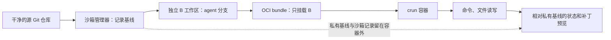

# bbm-sandbox：C++ Agent 沙箱 SDK

这是一个面向 Linux 的 C++17 Agent 沙箱 SDK。它从干净的 Git 仓库创建独立任务工作区，在 OCI 容器中运行命令，并提供工作区文件读写和改动预览。工作区操作使用 libgit2 builtin API；容器和 VM 内共用常驻 agentd，libcrun 工作进程负责生命周期操作。

当前实现适合本机开发、集成和学习容器隔离流程；它还不是可直接暴露给不可信用户的生产服务。

## 已实现功能

- **沙箱管理：**创建、查询、执行、预览改动和停止沙箱。默认以普通用户和 rootless crun 运行。
- **独立 Git 工作区：**每个沙箱得到自己的 `agent` 分支和 Git 元数据。Agent 可以在容器中使用 Git 并提交；源仓库不挂入容器，也不会被任务修改。
- **隔离的基线与预览：**管理器在容器外保留私有基线。状态和二进制补丁都相对该基线生成，因此 Agent 在工作区内提交后，改动仍可预览。
- **两种容器环境：**默认的 HostTools 模式以只读挂载复用本机工具链；Minimal 模式使用静态 BusyBox、Git 和文件助手构建较小的环境。
- **受监督的命令执行：**参数数组直接传给进程，不经 shell 拼接；分别捕获 stdout/stderr，并处理超时、输出上限及二进制 stdin。
- **受限的文件 API：**SDK 可在工作区内读写二进制文件；路径边界、符号链接、特殊文件和文件大小均受检查，写入采用同目录临时文件和原子替换。
- **C++ SDK：**构建树和安装包均提供 `sandbox_core`；安装包导出 CMake target `bbm::sandbox_core`。
- **可替换后端：**管理器通过 `WorkspaceBackend` 与 `RuntimeBackend` 调用实现；OCI 配置、挂载、cgroup 检查和文件助手属于 OCI 后端。接口预留 guest 工作区同步步骤，供后续 VM 后端使用。

## 工作流程



源仓库必须是已提交且干净的 Git 工作树，暂不支持 submodule。B 工作区从选定提交创建，包含该提交可达的历史；其他分支、未提交内容、未跟踪文件和忽略文件不会复制进去。沙箱目录必须新建在源仓库之外，且其父目录已存在。

`GitWorkspace` 可单独创建和检查 B 工作区，不启动容器。

## 环境与隔离

### HostTools（默认）

HostTools 为每个沙箱生成轻量 rootfs，并只读、非递归地挂载本机存在的系统工具目录：`/usr/bin`、`/usr/lib`、`/usr/lib64`、`/usr/libexec`、`/usr/include`、`/usr/share`、`/bin`、`/lib` 和 `/lib64`。具体挂载取决于本机目录布局；`/usr/bin` 和 `/usr/lib` 必须存在。

工作区默认挂载到 `/workspace`，通过 `Options::ctr_repo` 更改（SDK 示例将其设为 `/project`）。沙箱另有独立可写目录 `/build`、`/env` 和 `/cache`；它们不进入 Git 改动预览，停止沙箱后仍保留在沙箱目录中。默认环境变量包括：

- `PATH=/env/python/bin:/usr/bin:/bin`
- `HOME=/env/home`，`TMPDIR=/build/tmp`
- `XDG_CACHE_HOME=/cache`，`PIP_CACHE_DIR=/cache/pip`
- `PIP_REQUIRE_VIRTUALENV=true`

CMake、GCC/G++、Ninja、Python 等工具需要预先安装在导入的系统目录下。Python venv 可放在 `/env/python`。宿主机 home、`/run`、完整的 `/etc` 和 `/usr/local` 不会导入；HostTools 导入目录中的文件对任务可见，因此这些系统目录不应存放需要隐藏的数据。该模式会随本机工具升级，不提供版本锁定。

### Minimal

Minimal 仅准备 BusyBox、Git、SDK 文件助手及 Git 运行所需动态库。它要求 `/usr/bin/busybox` 为静态链接版本，并依赖宿主机的 `/usr/bin/file` 和 `/usr/bin/ldd`，适用于需要较小工具集的场景。

### 默认隔离与资源限制

rootless 模式下，容器内 UID/GID 0 各自映射到当前宿主机用户的一个 UID/GID；容器内的 root 不等于宿主机 root。任务没有 Linux capabilities，启用 noNewPrivileges，rootfs 只读。工作区可写，HostTools 的 build、env、cache 可写；`/tmp` 和 `/dev/shm` 是各自 16 MiB 的临时文件系统。网络命名空间隔离，默认没有外网连接。

默认限制为：

| 项目 | 默认值 |
|---|---:|
| 内存 | 256 MiB |
| Swap | 0 |
| CPU | 1 核配额（period 100000 µs，quota 100000 µs） |
| 进程数 | 64 |
| 单条命令超时 | 2000 ms |
| 命令输出上限 | 8 MiB |
| 单文件读写上限 | 8 MiB |

SDK 的 `Options` 可调整这些限制。内存和进程数控制器必须由 cgroup v2/systemd 用户沙箱委派。默认 CPU 配额还要求委派 CPU controller；本机尚未委派时，可用 `options.cpu_quota_us = 0` 显式关闭 CPU 配额进行调试。创建时会核对实际 cgroup 限制，未成功应用请求的限制时会拒绝创建沙箱。

需要启用这些委派时，可由管理员为 systemd 用户服务添加配置，然后重新加载 systemd 并重新登录：

```ini
# /etc/systemd/system/user@.service.d/delegate.conf
[Service]
Delegate=cpu memory pids
```

```bash
sudo systemctl daemon-reload
# 退出并重新登录，使用户服务重新加载委派设置
```

文件助手依赖 Linux 5.6+ 的 `openat2`。内核不支持时，文件读写会失败，不会降级到较弱的路径检查方式。

## 构建

首次先执行 `./tools/build-deps.sh --jobs 4`，构建工具清单见 [依赖说明](doc/dependencies.md)。

依赖 Linux、CMake 3.21+、C/C++17 编译器、libcrun、libgit2 和 `nlohmann_json`。Git 命令仍用于 Agent 的容器内操作和测试，管理器的工作区操作使用 libgit2。rootless 沙箱要求用户命名空间和 cgroup v2。若项目旁边有 `../vcpkg`，CMake 自动使用其中的 toolchain；三个预设共享 `build/vcpkg_installed` 中的依赖。

构建入口统一为三个预设：

| 预设 | 编译类型 | 内容 | 资源位置 |
|---|---|---|---|
| `release` | Release | 可安装 SDK，关闭测试和基准 | 安装目录 |
| `debug` | Debug | SDK 和调试符号，关闭测试和基准 | 开发构建目录 |
| `test` | RelWithDebInfo | SDK 和完整测试套件 | 测试构建目录 |

日常开发：

```bash
cmake --preset debug
cmake --build --preset debug
```

运行测试（rootless 容器和 VM 集成测试要求本机具备对应内核、cgroup 和 KVM 配置）：

```bash
cmake --preset test
cmake --build --preset test
ctest --preset test
```

构建并安装 Release SDK，默认安装到 `build/install`：

```bash
cmake --preset release
cmake --build --preset release
cmake --install build/release
```

Release 库默认使用配置时确定的安装路径；运行前需要完成安装。移动后可显式设置 `BBM_SANDBOX_RESOURCE_DIR`。更改前缀可以用 `cmake --preset release -DCMAKE_INSTALL_PREFIX=/your/prefix`，随后重新构建和安装。Debug、Test 的开发资源路径不能直接用于分发。

三个预设分别使用 `build/release`、`build/debug`、`build/test`，均启用当前的 libkrun 后端。`debug` 和 `release` 的统一目标是 `sandbox-sdk`，`test` 是 `sandbox-tests`。后者构建测试程序，实际运行测试使用 `ctest`。内部助手按依赖构建并在支持 target folder 的 IDE 中归入 `SDK/Internal`；内部程序只保留 agentd 与运行时生命周期助手；Git 和文件读写的独立入口已删除。

运行时依赖默认来自 `.deps/prefix`，先执行 `./tools/build-deps.sh --jobs 4`。固定版本、系统构建依赖、外部 prefix 和完整验证步骤见 [可移植依赖](doc/dependencies.md)。仅使用 OCI 时，脚本加 `--without-krun`，CMake 加 `-DSANDBOX_ENABLE_LIBKRUN=OFF`。不再探测个人目录中的 crun 源码或 libkrun 安装。

顶层 `CMakeLists.txt` 负责选项和构建入口，`cmake/Sandbox*.cmake` 分别负责依赖、内部助手、SDK 库、安装、测试和基准。基准默认关闭，开启和运行方式见 [benchmarks/README.md](benchmarks/README.md)。个人配置可放在已忽略的 `CMakeUserPresets.json` 中。

安装包提供 SDK 库、公共头文件、内部助手，并导出 `bbm::sandbox_core`。调用方还需能找到 nlohmann_json 的 CMake package；libgit2 由 SDK 库直接链接，包配置会查找它；libcrun/libkrun 仍是私有运行时依赖。开发助手位于 `build/<preset>/libexec/bbm-sandbox/`，安装助手位于 `PREFIX/libexec/bbm-sandbox/`；缺失时明确失败，不从调用程序旁或 PATH 查找。

## C++ SDK 示例

CMake 调用方安装 SDK 后可链接 `bbm::sandbox_core`：

```cmake
find_package(bbm-sandbox CONFIG REQUIRED)
target_link_libraries(my_app PRIVATE bbm::sandbox_core)
```

SDK 通过 `Sandbox` 提供 `create`、`execute`、`read`、`write`、`status`、`get_changes`、`stop` 和 `destroy`：

```cpp
#include "sandbox.hpp"
#include <chrono>
#include <iostream>

int main() {
    Sandbox sandbox; // 普通用户默认使用 rootless libcrun
    Options options;
    options.src_repo = "/absolute/path/to/clean-repo";
    options.ctr_repo = "/project";
    options.cwd_rlt = ".";
    options.cmd_timeout = std::chrono::seconds(10);
    // 开发机没有委派 CPU controller 时，显式取消 CPU 配额。
    // 已委派时省略此行，使用默认一核配额。
    options.cpu_quota_us = 0;

    const SandboxInfo info = sandbox.create(options);
    try {
        sandbox.write("/project/hello.txt", "hello\n");
        std::cout << sandbox.read("/project/hello.txt");

        CommandRequest request;
        request.argv = {"/usr/bin/git", "-C", "/project", "status", "--short"};
        const Result result = sandbox.execute(request);
        std::cout << result.out;
        std::cerr << result.err;
        const Changes preview = sandbox.get_changes();
        std::cout << preview.diff;
    } catch (...) {
        sandbox.stop();
        throw;
    }
    sandbox.stop(); // 保留 B 和沙箱记录
}
```

执行命令时不传入 shell 字符串；`CommandRequest::stdin_data` 可携带二进制 stdin。文件 read/write 只接受工作区内的容器绝对路径，并要求沙箱处于 Active 状态。

### 接口与生命周期

| SDK 接口 | 行为 |
|---|---|
| `create(options)` | 校验策略，创建独立 B，启动并核对资源限制 |
| `execute(request)` | 接受 argv、相对工作区的 cwd 和二进制 stdin，返回退出码、输出和限制标志 |
| `read(path)` / `write(path, content)` | 容器内访问 B；父目录必须存在，写入采用原子替换 |
| `status()` / `get_status()` | 查询运行状态与沙箱业务状态 |
| `get_changes()` | 暂停、同步、生成相对私有基线的状态和补丁，再恢复；属于预览 |
| `stop()` | 幂等停止运行环境，保留工作区和记录 |
| `destroy()` | 确认运行环境已回收，然后删除 B 和沙箱目录；用于舍弃结果 |

read/write 拒绝工作区外路径、`..`、符号链接与特殊文件；write 还拒绝硬链接目标。
文件错误抛出异常；命令正常结束时通过 `Result::runtime_status` 返回退出码，非零退出码不关闭沙箱。
命令超时或输出超限会关闭运行环境，持久标记 `Failed`，保留 B 供检查。

默认管理目录为普通用户的 `$XDG_STATE_HOME/bbm-sandbox`，未设置时使用
`~/.local/state/bbm-sandbox`；root 用户使用 `/var/lib/bbm-sandbox`。可通过构造函数指定其他目录，
后续打开同一沙箱需使用相同的目录与后端。管理目录必须由当前用户拥有，且组用户和其他用户不可写。
旧记录缺少后端字段时按 `oci-crun`/`git` 处理；不同后端的记录会被拒绝打开。

独立工作区 API `GitWorkspace::create/open/status/diff` 也予以保留。
`files/` 是任务可写的 B，`sandbox.git/` 和 `session.txt` 是容器外的管理数据。
补丁含已提交、未提交、新增、删除和二进制文件改动；忽略文件不导出，补丁输出上限为 1 MiB。

### 替换运行时后端

```cpp
// 显式选择默认后端；也可独立替换工作区实现。
Sandbox sandbox(default_sandbox_root(), make_libcrun_backend());

// 之后的 VM 实现可通过同一构造函数注入：
// Sandbox sandbox(root, make_your_vm_backend(trusted_config));
```

`RuntimeBackend` 提供环境准备、启动、状态、执行、读写、暂停、恢复、同步工作区和停止接口。
管理器在预览时执行 `pause → synchronize_workspace → WorkspaceBackend::inspect → resume`。
当前 OCI 后端直接挂载 B，同步步骤无需拷贝；VM 后端须在这个步骤将 guest 结果导出到宿主机 B。
`stop` 必须回收执行资源并保留可供检查的 B，文件边界与 guest 传输也由后端负责。
详细契约和 libkrun 接入方向见 [后端设计](doc/backends.md)。默认运行时仍为 libcrun；可选 libkrun 后端已接入真实 KVM，见下方使用方法。

已实现独立的 Host Agent 客户端、Guest 服务与自己的 CBOR 协议子集，支持执行、取消和分块文件读写。
协议与传输分别封装，支持 socket 和专用 virtio 字符端口；用法、消息格式及限制见
[Guest 协议](doc/agent-protocol.md)。libkrun 后端通过此组件接入 `Sandbox` 的 VM 生命周期。

## 使用 libkrun VM 后端

依赖 libkrun 1.19.6 和匹配的 libkrunfw 5.x；本机验证版本为 5.6.2。
libkrun 位于 Host 隔离边界内的独立工作进程，SDK 调用方无需链接 Rust/VMM 库。
三个标准预设均启用 VM；需要指定 libkrun 安装位置时：

```bash
./tools/build-deps.sh --jobs 4
cmake --preset debug
cmake --build --preset debug
```

SDK 显式选择后端：

```cpp
#include <sandbox.hpp>
#include <virtualization/microvm/libkrun_runtime.hpp>

Sandbox sandbox(default_sandbox_root(), make_libkrun_backend());
Options options;
options.src_repo = "/absolute/path/to/repository";
options.ctr_repo = "/project";
options.memory_bytes = 512 * 1024 * 1024;
// 本机未委派 cpu controller 时才显式关闭配额；否则保留默认值。
options.cpu_quota_us = 0;
auto info = sandbox.create(options);
sandbox.write("/project/hello.txt", "hello\n");
auto result = sandbox.execute({"/bin/cat", "/project/hello.txt"});
auto preview = sandbox.get_changes();
sandbox.stop(); // 回收 VM，保留 B
// 确定舍弃后调用：sandbox.destroy();
```

当前实现要求普通用户可访问 `/dev/kvm`、rootless namespace 和 systemd cgroup v2
委派；不自动降级为 Host 执行或关闭资源限制。首次启动等待 ready 最长 30 秒，
可通过可信 `LibkrunConfig` 调整 vCPU 数和启动期限。

HostTools 通过限定的只读系统工具目录构建 Guest 视图；Minimal 使用静态 BusyBox 和
必要程序，不要求手工维护镜像模板。Guest 根文件系统只读，B 和沙箱内 build/env/cache
分别通过 virtiofs 共享，`/tmp` 使用 Guest tmpfs。不共享源 A、Manager Git 元数据、
Host 家目录或 Host 服务 socket。网络默认关闭，并显式关闭 libkrun 的 TSI 自动代理。

`memory_bytes` 是整个 Host VMM cgroup 的内存预算，禁止 swap；其中一半配置为 Guest RAM，
另一半预留给 VMM 和文件缓存，最小总预算 256 MiB。`max_tasks` 限制 Guest 任务 cgroup；
Host VMM 的线程限额为 `max(128, max_tasks)`。CPU 配额施加在整个 VMM 上。

Guest 控制服务使用 UID 0，Agent 命令使用 UID/GID 65534、空有效 capabilities 和
no-new-privileges。Guest idmapped mount 将 B 的文件所有者映射给任务身份，Host 上
仍归当前用户所有。每条命令结束后回收整个任务 cgroup，包括 setsid 后的子进程。

预览前先冻结任务、执行 Guest syncfs，再冻结 VMM；B 即共享目录，无需整树导出。
恢复先解冻 VMM，再解冻任务。停止回收 VM 与 Host cgroup，保留 B 和 `vm-console.log`。
超时或输出超限使沙箱 Failed 并回收 VM。安装版构建同样需要开启该选项，且保留依赖库安装。
磁盘配额、网络白名单、自动 merge 和崩溃后的自动回收仍待实现。

## 测试覆盖

测试直接调用 SDK，不使用公开 CLI 的测试驱动。CTest 注册的测试包括：

- `process-supervisor`：进程输出、退出状态、超时、输出限制和 stdin。
- `git-workspace`：真实临时 Git 仓库、基线、文件增删改、二进制 diff 和源仓库保护。
- `sandbox-lifecycle`：直接调用 SDK，使用 RuntimeBackend 测试替身验证沙箱 API、状态和错误策略。
- `agent-protocol`：固定 wire 样本、畸形 CBOR、分片、超大帧、部分帧超时。
- `guest-service`：启动真实 Guest 服务程序，验证执行/取消、二进制输入输出、文件边界、断线回收。
- `runtime-backend`：独立 guest 传输测试替身，验证无 OCI bundle/cgroup 假设、文件 API 委派、预览前同步、超时回收和后端身份检查。
- `sandbox-crun` 与 `sandbox-crun-minimal`：rootless HostTools/Minimal 容器、隔离与资源限制。
- `sandbox-krun-minimal` 与 `sandbox-krun-host-tools`：真实 KVM/vsock、任务身份、文件边界、后台子进程回收、同步预览、G++ 编译以及超时/输出超限回收。
- `sdk-install`：安装 SDK 后由独立 CMake 程序链接和调用；验证固定助手路径、助手缺失时明确失败，以及不安装 CLI/内部传输头文件。

运行全部测试：

```bash
ctest --test-dir build --output-on-failure
```

其中 sandbox-crun 测试会实际启动容器，并检查本机的 user namespace、cgroup 委派和工具链；相关环境未就绪时测试不能通过。

## 当前未实现

- 冻结沙箱、校验任务最终结果、固定最终提交及结构化提交结果。
- 将结果合并或应用到源仓库；当前只提供相对基线的改动预览。
- Manager 崩溃后的自动恢复和遗留沙箱回收。
- B、build、env、cache 的磁盘配额。
- seccomp/LSM 加固、强制网络策略、多 UID 映射和宿主机残留进程检查。
- 可配置的自定义工具/依赖目录导入和联网下载策略。
- 后台任务策略；每沙箱的 SDK 操作有锁，但外部编辑者或脱离命令管道继续运行的进程不受该锁约束。
- Git 工作进程的独立内存配额和 SHA-256 仓库支持（当前 libgit2 配置使用 SHA-1）。

因此，请将它视作隔离沙箱原型，而不是完整的多租户安全边界。不要把管理器以 setuid 方式安装，也不要让不可信调用方控制宿主机 bundle 路径、挂载或 crun 参数。

## Guest 常驻服务 agentd

Guest 只部署一个 `agentd`。Host 的 exec/read/write 请求通过私有 vsock/CBOR 通道进入服务，再分派到内部处理函数；Agent 不通过命令行控制服务。`--serve` 仅用于可信启动器传入工作区与传输配置。

执行命令时，服务使用 `posix_spawn` 启动同一个只读 `agentd` 的内部 `--run-task -- COMMAND...` 模式。子进程先加入固定任务 cgroup，设置 rlimit、清除附加组、降至 UID/GID 65534 并禁止提权，然后 `execv` 用户命令。父进程持续处理协议、输出、取消与回收。

`src/agent/task_runner.cpp` 保留任务准备函数，已无独立 main 或构建目标；不再部署 `sandbox-task`。非特权任务再次调用内部任务模式会被拒绝。这个模式不是 vsock RPC 操作，也不能由请求选择 cgroup 或服务权限。

## 单实例 Sandbox

一个 `Sandbox` 对象代表一个独立 B 工作区和一个容器/VM。先调用 `create(options)` 创建，或用 `open(id)` 重新打开已有沙箱；绑定后不能再创建或切换到另一个沙箱。多个隔离环境由调用方创建多个 `Sandbox` 对象。

`SandboxInfo` 保存 ID、工作目录、运行时 ID、基线 commit 和配置，`SandboxState` 表示生命周期，`status()` 返回 `SandboxStatus`。`read/write/execute/get_changes/stop/destroy` 都不传 ID。

```cpp
Sandbox sandbox(default_sandbox_root(), make_libkrun_backend());
auto info = sandbox.create(options);
sandbox.write("/workspace/main.cpp", contents);
auto result = sandbox.execute({"/usr/bin/g++", "/workspace/main.cpp", "-o", "/build/app"});
sandbox.stop(); // 保留 B 和元数据，支持之后重新打开

Sandbox restored(default_sandbox_root(), make_libkrun_backend());
restored.open(info.id);
auto changes = restored.get_changes();
restored.destroy(); // 删除 B，重复调用安全
```

新元数据为 `sandbox.json`；旧 `session.json` 记录仍可读取，并在保存时迁移。C++ 对象析构不会自动删除持久化沙箱，使用者应显式调用 `stop()` 或 `destroy()`。这是 SDK API 的不兼容变更，调用方需要重新编译并移除操作参数中的 ID。

仍在运行的沙箱由一个持久连接持有。交给新 `Sandbox` 句柄或低层协议客户端接管前，
先析构旧句柄以断开连接；析构不会停止容器/VM。同一个环境暂不支持多个句柄同时持有连接。

## 常驻 agentd 与流式输出

容器和 VM 共用常驻任务服务及 CBOR 协议，执行/读写不再每次启动 runtime 或文件助手。
容器使用只向 PID 1 传入的宿主 listener FD，VM 使用 vsock 代理；两者复用共享 communication
层。SDK 的 `execute(request, callback)` 提供 stdout/stderr 二进制分块回调；`cancel()` 可以从
回调或另一线程发送取消。生命周期回收仍由后端独立负责。

架构、控制通道边界、Git builtin 的超时约束和示例见 [通信设计](doc/communication.md)。
此次调整不兼容旧版正在运行的容器，需要回收后重新创建。
